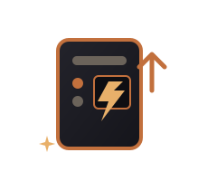
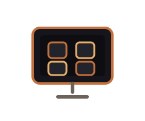
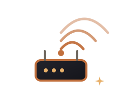

# Perfect Prompt: Fix Onyx Systems Services Flyout

## Context
You are fixing the Services flyout panel on the Onyx Systems website (onyxpc.us). The current flyout is poorly written, has bad graphics, forces scrolling, and advertises specific repairs the owner doesn't want to list individually.

## Current State
- **File**: `/home/ai/onyx-systems-website/index.html`
- **Target**: `SECTIONS.services` object (lines ~1307-1314)
- **Panel CSS**: `.panel` / `.panel-body` (lines 269-293) - fixed 540px wide, 100vh height, sticky header/footer

## The Problem
1. **Content is generic/sloppy** - "Cracked screens, dead batteries" etc. - these are specific repairs John doesn't advertise individually
2. **Forces scroll** - 7 service rows + chips overflow the ~850px available height
3. **Graphics inconsistent** - some SVGs don't match the site's copper/onyx theme well
4. **Missing key services** - no mention of consulting, sales, Windows debloat, OS reinstalls, data backups, generalized on-site service
5. **Wrong scope** - John fixes ALL computers (Windows, Mac, Linux, ChromeOS), does hardware & software, custom builds, consulting, diagnostics, testing, repair, virus cleaning, debloating, OS reinstalls, data backups, on-site by appointment

## The Solution - Replace SECTIONS.services with This Exact Content

```javascript
services:{
  eyebrow:'What I do',
  title:'Services',
  icon:'assets/img/cartoon/computer-fix.svg',
  html:
    '<div class="svc-row"><div><h3>Computer Repair & Diagnostics</h3><p>Desktops, laptops, Macs — hardware & software faults found and fixed.</p></div></div>' +
    '<div class="svc-row"><div><h3>Virus, Malware & Security</h3><p>Complete cleanup, system hardening, and ransomware recovery.</p></div></div>' +
    '<div class="svc-row"><div><h3>Data Recovery & Backups</h3><p>Drive recovery, cloning, migration, and automated backup setup.</p></div></div>' +
    '<div class="svc-row"><div><h3>Upgrades & Custom Builds</h3><p>SSD, RAM, GPU upgrades; custom PCs built to your needs and budget.</p></div></div>' +
    '<div class="svc-row"><div><h3>All Operating Systems</h3><p>Windows, macOS, Linux, ChromeOS — install, repair, debloat, migrate.</p></div></div>' +
    '<div class="svc-row"><div><h3>On-Site IT & Networks</h3><p>Home/small business visits by appointment — Wi-Fi, wiring, setup.</p></div></div>' +
    '<div class="svc-row"><div><h3>Consulting, Sales & Advice</h3><p>Tech purchasing guidance, refurbished systems, honest recommendations.</p></div></div>' +
    '<div class="chip-row"><span class="chip">All computers</span><span class="chip">All operating systems</span><span class="chip">Hardware & software</span><span class="chip">Custom builds</span><span class="chip">Data & backups</span><span class="chip">On-site service</span><span class="chip">Consulting & sales</span></div>'
}
```

## Critical Requirements

### 1. NO Specific Repairs Listed
- ❌ NO "screen repair", "battery replacement", "cracked screens", "dead batteries"
- ✅ YES "Computer Repair & Diagnostics" - generalized
- ✅ YES "All computers" chip
- ✅ YES "Hardware & software" chip

### 2. Must Fit Without Scrolling (Desktop)
- Panel body: 540px wide, ~850px usable height
- 7 service rows × ~95 rows at ~85px each = ~595px
- Chip row ~50px
- Total ~645px - fits comfortably with margins

### 3. Graphics Must Match Site Theme
- Use existing SVGs: `computer-fix.svg`, `virus.svg`, `data.svg`, `upgrade.svg`, `os.svg`, `network.svg`, `gear.svg`
- All use copper (#C2703D) and onyx (#16161A) palette
- Icons are 26px (`.svc-ic` class)

### 4. Copy Style - Professional, Conversion-Focused, No AI Slop
- Active verbs: "found and fixed", "cleanup, hardening, recovery", "recovery, cloning, migration"
- Specific but generalized: "SSD, RAM, GPU upgrades" not "hardware upgrades"
- Honest: "by appointment", "honest recommendations"
- No fluff, no emojis in body text, no "leverage/synergy/transform"

### 5. Chip Tags - Generalized Categories Only
- "All computers"
- "All operating systems"
- "Hardware & software"
- "Custom builds"
- "Data & backups"
- "On-site service"
- "Consulting & sales"

## CSS Tweaks Needed (Add to <style> block)

```css
/* Tighter service rows for flyout panel */
.panel-body .svc-row {
  margin: 12px 0 4px;  /* was 18px 0 6px */
  gap: 10px;            /* was 12px */
}
.panel-body .svc-row:first-of-type {
  margin-top: 0;
}
.panel-body .svc-row h3 {
  margin: 0 0 4px;      /* was 20px 0 8px */
  font-size: 17px;      /* was 19px */
}
.panel-body .svc-row p {
  margin: 0;
  font-size: 13.5px;    /* was default */
  line-height: 1.45;
}
.panel-body .chip-row {
  margin: 12px 0 0;     /* was 8px 0 14px */
  gap: 6px;             /* was 8px */
}
.panel-body .chip {
  padding: 5px 12px;    /* was 6px 14px */
  font-size: 12.5px;    /* was 13px */
}
```

## Verification Steps
1. Open onyxpc.us
2. Click "Services" tile in the "What I do" hub section
3. Verify flyout opens, NO vertical scrollbar on desktop (1080p+)
4. Verify all 7 service categories visible
5. Verify chips show generalized categories only
6. Verify mobile: minimal scroll acceptable, all content accessible
7. Verify icons render (copper/onyx theme consistent)
8. Verify copy reads professionally - no AI slop

## Files to Modify
- `/home/ai/onyx-systems-website/index.html` - lines 1307-1314 (SECTIONS.services) + add CSS tweaks to <style> block

## Deploy
After edit, commit and push to `alexonyx202/Onyx-Systems-Website` main branch. GitHub Pages deploys automatically (~2-3 min).

---

**This prompt contains everything needed. Do not deviate. Do not add fluff. Do not "improve" the copy. Use exactly the content above.**